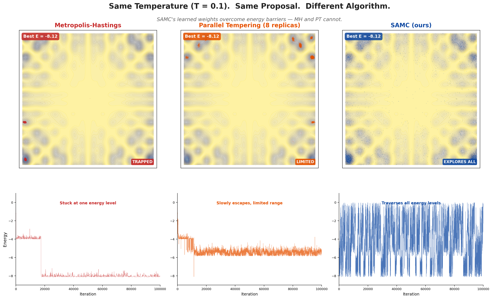

# illuma-samc

[](https://github.com/FrankShih0807/illuma-samc/actions/workflows/ci.yml)

**Your MH sampler gets stuck at low temperature. Fix it with two lines.**



Same energy landscape. Same proposal. Same compute budget. At T=0.1, **MH gets trapped** in a single basin. **SAMC explores everything**.

## Two Lines. That's It.

If you already have a Metropolis-Hastings loop, add two lines to get SAMC:

```python
from illuma_samc import SAMCWeights

wm = SAMCWeights()                                        # <- new

for t in range(1, n_steps + 1):
    x_new = propose(x)
    fy = energy_fn(x_new)

    log_r = (-fy + fx) / T + wm.correction(fx, fy)        # <- add correction
    if log_r > 0 or math.log(random()) < log_r:
        x, fx = x_new, fy

    wm.step(t, fx)                                         # <- update weights
```

That's it. No energy range needed -- bins are created automatically on the first step and expand as the sampler explores.

Works batched too -- pass tensors instead of scalars:

```python
wm = SAMCWeights()

# z: (N, dim) -- batch of N states
# energy, energy_prop: (N,) -- one scalar energy per state
for t in range(1, n_steps + 1):
    z_prop = z + 0.25 * torch.randn_like(z)       # (N, dim)
    energy_prop = energy_fn(z_prop)                # (N,)

    log_alpha = (-energy_prop + energy) / T + wm.correction(energy, energy_prop)  # (N,)
    accept = torch.rand_like(log_alpha).log() < log_alpha                         # (N,)

    z = torch.where(accept.unsqueeze(-1), z_prop, z)   # (N, dim)
    energy = torch.where(accept, energy_prop, energy)   # (N,)
    wm.step(t, energy)                                  # (N,)
```

If you know your energy range, pass a `UniformPartition` for precise control:

```python
from illuma_samc import SAMCWeights, UniformPartition, GainSequence

wm = SAMCWeights(
    partition=UniformPartition(e_min=0, e_max=10, n_bins=40),
    gain=GainSequence("1/t", t0=1000),
)
```

### The Payoff

|                  |         MH |       SAMC |
|------------------|-----------:|-----------:|
| Accept rate      |      0.047 |      0.412 |
| Bin flatness     |        N/A |      0.990 |
| Best energy      |     -8.125 |     -8.125 |
| Extra code       |    0 lines |    2 lines |

*2D multimodal benchmark, 500K steps, T=0.1. See [`mh_vs_samc.ipynb`](mh_vs_samc.ipynb) for the full comparison with plots.*

## Install

Requires PyTorch >= 2.0. See [pytorch.org](https://pytorch.org) for installation instructions.

```bash
pip install -e ".[dev]"
```

## Starting from Scratch?

If you don't have an existing MH loop, use the `SAMC` class directly:

```python
import torch
from illuma_samc import SAMC

def energy_fn(x):
    return torch.min(
        0.5 * torch.sum((x - 2) ** 2),
        0.5 * torch.sum((x + 2) ** 2),
    )

sampler = SAMC(energy_fn=energy_fn, dim=2)
result = sampler.run(n_steps=100_000)

print(f"Best energy: {result.best_energy:.4f}")
print(f"Acceptance rate: {result.acceptance_rate:.3f}")
```

Multi-chain (independent weights by default):

```python
sampler = SAMC(energy_fn=energy_fn, dim=2, n_chains=4)
result = sampler.run(n_steps=100_000)
# result.samples has shape (4, n_saved, dim)
# Each chain explores independently with its own partition and proposal
```

For shared weights across chains (all chains update one theta):

```python
sampler = SAMC(energy_fn=energy_fn, dim=2, n_chains=4, shared_weights=True)
```

Full control over proposal, partition, and gain:

```python
from illuma_samc import SAMC, GainSequence, GaussianProposal, UniformPartition

sampler = SAMC(
    energy_fn=energy_fn,
    dim=2,
    proposal_fn=GaussianProposal(step_size=0.5),
    partition_fn=UniformPartition(e_min=0, e_max=10, n_bins=40),
    gain=GainSequence("1/t", t0=1000),
    temperature=0.1,
)
result = sampler.run(n_steps=100_000, burn_in=100)
sampler.plot_diagnostics()
```

## Adaptive Step Size

Don't know the right `proposal_std`? Let it tune itself via dual averaging:

```python
sampler = SAMC(energy_fn=energy_fn, dim=2, adapt_proposal=True)
result = sampler.run(n_steps=100_000)
print(f"Tuned step size: {sampler._proposal.step_size:.4f}")
```

Works with `SAMCWeights` too -- use `GaussianProposal` directly:

```python
from illuma_samc import SAMCWeights
from illuma_samc.proposals import GaussianProposal

proposal = GaussianProposal(step_size=1.0, adapt=True)  # any starting guess
wm = SAMCWeights()

for t in range(1, n_steps + 1):
    x_new = proposal.propose(x)
    fy = energy_fn(x_new)

    log_r = (-fy + fx) / T + wm.correction(fx, fy)
    accepted = log_r > 0 or math.log(random()) < log_r
    if accepted:
        x, fx = x_new, fy
    proposal.report_accept(accepted)                     # tune step size
    wm.step(t, fx)
```

Tested with initial step sizes from 0.01 to 5.0 -- adaptive always finds the global minimum and achieves >0.89 flatness, while fixed step sizes fail badly at extremes.

## Zero-Config Quick Start

For problems up to ~20D, just use defaults with `adapt_proposal=True` — no manual tuning needed:

```python
sampler = SAMC(
    energy_fn=energy_fn,
    dim=dim,
    n_chains=4,
    adapt_proposal=True,
    adapt_warmup=2000,
)
result = sampler.run(n_steps=200_000)
```

Validated against hand-tuned ablation winners (500K-200K iters, 5 seeds each):

| Problem | Dim | Zero-Config vs Hand-Tuned | Verdict |
|---------|-----|--------------------------|---------|
| 2D Multimodal | 2 | Identical (-8.1246) | Use defaults |
| Rosenbrock | 2 | Identical (E≈0) | Use defaults |
| Rastrigin | 20 | Identical (E=0) | Use defaults |
| Gaussian Mix | 10 | +49% gap | Set energy range |
| Gaussian Mix | 50 | +114% gap | Set energy range |
| Gaussian Mix | 100 | +305% gap | Set energy range + n_partitions |

For high-dimensional problems (dim >= 20 with widely-separated modes), specify the energy range:

```python
sampler = SAMC(
    energy_fn=energy_fn,
    dim=50,
    n_chains=4,
    n_partitions=40,
    e_min=0.0,
    e_max=60.0,
    adapt_proposal=True,   # still auto-tunes step size
)
```

## Tuning Guide

Based on ablation studies across 6 problems (2D to 100D), 12 parameter groups, 600+ runs, and a dedicated robust-defaults validation (60 runs):

**What is now auto-handled:**
1. **Proposal step size** -- `adapt_proposal=True` auto-tunes via dual averaging. Start with any value; it converges to the right size.
2. **Energy range for low-dim** -- auto-range warmup works reliably for dim < 20.

**Sensitivity ranking for remaining parameters** (most impactful first):
1. **Energy range (dim >= 20)** -- auto-range breaks down in high dimensions because warmup trajectories over-explore. Set `e_min`/`e_max` explicitly.
2. **Gain schedule** -- use `ramp` or `1/t`. `ramp` is the default and works well.
3. **Gain t0** -- use t0 >= 1000. Too small (100) gives poor flatness.
4. **Number of bins** -- 20-80 works well; scale up (~40-50) for higher-dimensional problems.
5. **Number of chains** -- 4-8 chains with shared weights gives best flatness.

**Rule of thumb for energy range (high-dim):**
Run a short MH probe to estimate energy range. Set `e_min` slightly below the minimum, `e_max` at the 90th-95th percentile of observed energies (not the max). A range that's too wide is almost as bad as too narrow.

**When to use SAMC vs plain MH:**
- For **optimization** (finding the minimum): start with MH. It's fastest.
- For **sampling** (covering the energy landscape): use SAMC. It provides flat-histogram exploration guarantees.
- For **hard multimodal problems** (20D+, many local minima): SAMC with 8-16 chains outperforms both MH and PT.

**Cross-algorithm comparison** (best energy, mean +/- std, 200K iterations x 4 chains, 5 seeds):

All algorithms use identical compute budgets (800K energy evals each), the same random starting points, and adaptive Gaussian proposals (`GaussianProposal(step_size=1.0, adapt=True)`). SAMC is zero-config — no hand-tuned energy range or partition. Each chain runs with independent weights.

| Problem | Dim | MH | PT | SAMC (default) |
|---------|-----|----|----|----------------|
| 10D Gaussian Mixture | 10 | **0.24 +/- 0.06** | 0.27 +/- 0.08 | 0.31 +/- 0.06 |
| 50D Gaussian Mixture | 50 | 8.99 +/- 0.68 | 9.61 +/- 0.94 | **3.43 +/- 0.60** |
| 100D Gaussian Mixture | 100 | 24.64 +/- 0.86 | 27.20 +/- 0.81 | **13.40 +/- 1.61** |
| Rastrigin 20D | 20 | 22.86 +/- 3.35 | **19.34 +/- 1.92** | 21.29 +/- 3.20 |

Bold = best result per row. Lower is better.

At low dimension (10D), all three algorithms perform similarly — MH converges quickly and SAMC's flat-histogram overhead is a slight disadvantage. But SAMC's exploration advantage grows with dimension: it achieves **2.6x better energy than MH at 50D** and **1.8x better at 100D**, without any tuning. PT stays close to MH throughout and never escapes the high-dimensional curse. On Rastrigin (highly multimodal), PT has a slight edge; set `e_min/e_max` explicitly for better SAMC results on this problem (see [Tuning Guide](#tuning-guide)).

See `benchmarks/three_way.py` for the reproducible benchmark and `ablation/reports/` for full analysis with figures.

## How It Works

SAMC partitions the energy space into $m$ subregions and learns **log-density-of-states estimates** $\theta_t$ that flatten the energy histogram. The MH acceptance ratio gains a weight correction:

$$\alpha = \min\left(1,\; \exp\left(\theta_{J(\mathbf{x})} - \theta_{J(\mathbf{y})} - \frac{U(\mathbf{y}) - U(\mathbf{x})}{T}\right)\right)$$

where $J(\mathbf{x})$ is the subregion index. After each step, the weights update via stochastic approximation:

$$\theta_{t+1} = \theta_t + \gamma_{t+1}(\mathbf{e}_{t+1} - \boldsymbol{\pi})$$

where $\gamma_t$ is a decreasing gain sequence, $\mathbf{e}_{t+1}$ is the indicator for the occupied subregion, and $\boldsymbol{\pi}$ is the desired visit frequency (uniform by default). As $\theta$ converges, the sampler visits all energy levels equally, escaping any local trap.

**Recovering the target distribution.** SAMC samples from a flattened distribution. Reweight each sample by $\exp(\theta_{J(\mathbf{x})})$ to recover the original target, or call `resample()` for unweighted draws.

## FAQ

**Q: How do I choose the energy range?**

A: You don't have to. `SAMCWeights()` auto-creates bins centered on the first energy it sees and expands as needed. If you know the range, pass `partition=UniformPartition(...)` for tighter bins.

**Q: Can I use SAMC for Bayesian posterior sampling?**

A: Yes. Set `energy_fn = -log p(x | data) - log p(x)`. Call `resample()` to recover unweighted posterior draws. Especially useful for multimodal posteriors where standard MCMC gets trapped.

**Q: What temperature should I use?**

A: Start with $T = 1.0$ for exploration, lower it (e.g., $T = 0.1$) to concentrate around the best solutions. Low temperature is exactly where MH gets trapped and SAMC shines.

**Q: `SAMC` vs `SAMCWeights`?**

A: **`SAMCWeights`** drops into your existing MH loop -- you control the proposal and acceptance. **`SAMC`** is batteries-included -- handles the loop, proposals, diagnostics, and burn-in.

## References

> **Faming Liang, Chuanhai Liu, and Raymond J. Carroll.** *Stochastic Approximation in Monte Carlo Computation.* Journal of the American Statistical Association, 102(477):305-320, 2007.

> **Faming Liang.** *On the Use of Stochastic Approximation Monte Carlo for Monte Carlo Integration.* Statistics & Probability Letters, 79(5):581-587, 2009.

See `CITATION.bib` for BibTeX entries.

## Acknowledgments

This is the first scientific research project under the [Illuma](https://github.com/FrankShih0807) umbrella -- and it was built in collaboration with [Claude](https://claude.ai), Anthropic's AI assistant. From architecture decisions to ablation studies to this README, Claude served as a hands-on research and engineering partner throughout the project.

## License

Free for academic and non-commercial research use. Commercial use requires permission.
