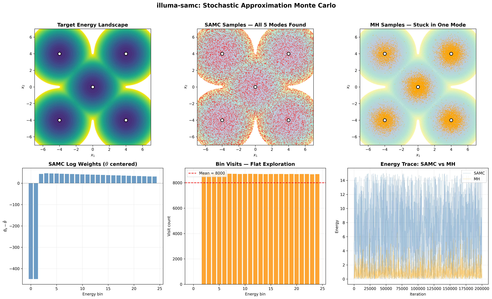
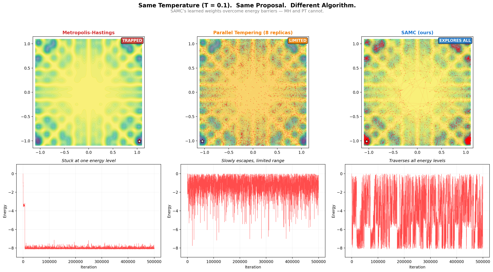

# illuma-samc

**Production-quality Stochastic Approximation Monte Carlo (SAMC) for PyTorch.**

Based on **SAMC by Faming Liang, Chuanhai Liu, and Raymond J. Carroll** — *"Stochastic Approximation in Monte Carlo Computation"*, Journal of the American Statistical Association, 2007.

SAMC is an adaptive MCMC algorithm that overcomes the local-trap problem by learning energy-dependent sampling weights on the fly. Unlike standard Metropolis-Hastings, SAMC explores all energy levels uniformly, making it effective for multimodal optimization and sampling.



## Why SAMC?

Standard Metropolis-Hastings gets trapped in local modes — it can spend an entire run exploring a single basin, completely missing the global optimum. SAMC fixes this by learning sampling weights that penalize over-visited energy regions and reward under-explored ones, producing **flat energy histograms** that guarantee uniform exploration across the entire landscape.

**MH gets stuck. SAMC doesn't.**

The figure above shows a 5-mode Gaussian mixture. SAMC discovers and samples all 5 modes with uniform bin visits, while MH remains trapped near its starting point. The flat bin visit histogram (bottom center) is the hallmark of SAMC — every energy level gets equal attention.

## Install

```bash
pip install -e .            # core (torch only)
pip install -e ".[viz]"     # + matplotlib for diagnostics
pip install -e ".[dev]"     # + ruff, pytest, matplotlib, tqdm
```

## Quick Start

### Simple Mode

Provide an energy function — the sampler handles everything else:

```python
import torch
from illuma_samc import SAMC

def energy_fn(x):
    """Two-well potential."""
    return torch.min(
        0.5 * torch.sum((x - 2) ** 2),
        0.5 * torch.sum((x + 2) ** 2),
    )

sampler = SAMC(energy_fn=energy_fn, dim=2, n_partitions=20, e_min=0, e_max=10)
result = sampler.run(n_steps=100_000)

print(f"Best energy: {result.best_energy:.4f}")
print(f"Best x: {result.best_x}")
print(f"Acceptance rate: {result.acceptance_rate:.3f}")
```

### Flexible Mode

Full control over proposal, partition, and gain schedule:

```python
from illuma_samc import SAMC, GainSequence, GaussianProposal, UniformPartition

sampler = SAMC(
    energy_fn=energy_fn,
    dim=2,
    proposal_fn=GaussianProposal(step_size=0.5),
    partition_fn=UniformPartition(e_min=0, e_max=10, n_bins=20),
    gain=GainSequence("ramp", rho=1.0, tau=1.0, warmup=1, step_scale=1000),
)
result = sampler.run(n_steps=100_000)
```

### Diagnostics

```python
sampler.plot_diagnostics()  # weight trajectory, energy trace, bin visits, acceptance rate
```

## Gain Schedules

| Schedule | Formula | Use case |
|----------|---------|----------|
| `"1/t"` | γ_t = t₀ / max(t, t₀) | Standard SAMC theory |
| `"log"` | γ_t = t₀ / max(t·log(t+e), t₀) | Faster decay |
| `"ramp"` | Warmup then power-law decay | Matches Liang's C implementation |
| callable | Any `(int) → float` | Custom schedules |

## Partition Types

- **`UniformPartition`** — Linear energy bins (default)
- **`AdaptivePartition`** — Recomputes boundaries from visited energies
- **`QuantilePartition`** — Boundaries from warmup energy quantiles

## Proposal Types

- **`GaussianProposal`** — Isotropic random walk
- **`LangevinProposal`** — MALA-style gradient-informed proposal via autograd

## Examples

```bash
python examples/demo_showcase.py      # All-in-one showcase (generates assets/demo_showcase.png)
python examples/gaussian_mixture.py   # 4-mode Gaussian demo
python examples/multimodal_2d.py      # Reproduce Liang's 2D experiment
```

## Benchmarks

### Sample Trajectories

The trajectory comparison below shows how each sampler explores the 2D multimodal energy landscape. SAMC covers the entire domain uniformly — MH gets trapped in local basins.



### Quantitative Results

SAMC vs Metropolis-Hastings vs Parallel Tempering on two problems. All methods use identical proposal, burn-in (10%), and sample collection frequency (every 100th iteration) for fair comparison.

| Problem | Method | Best Energy | ESS | Acc. Rate | Time (s) |
|---------|--------|-------------|-----|-----------|----------|
| 2D Multimodal | SAMC | -8.124 | 2399 | 0.213 | 24.7 |
| 2D Multimodal | MH | -8.124 | 1128 | 0.154 | 20.7 |
| 2D Multimodal | PT (8 replicas) | -8.124 | 47326 | 0.467 | 173.8 |
| 10D Gaussian | SAMC | 0.559 | 1413 | 0.221 | 5.1 |
| 10D Gaussian | MH | 0.385 | 3834 | 0.145 | 3.4 |
| 10D Gaussian | PT (8 replicas) | 0.804 | 9417 | 0.265 | 28.8 |

**Key takeaways:**
- **2D multimodal:** All methods find the global minimum (~-8.12). SAMC achieves 2x the ESS of MH at similar cost. PT has highest ESS but 7x the wall-clock time (8 replicas).
- **10D Gaussian mixture:** With properly tuned energy range, SAMC ESS (1413) is competitive at minimal cost. MH has higher ESS on this problem since the modes are well-separated and the energy landscape is smooth. PT is 6x slower.

Run benchmarks yourself:
```bash
python benchmarks/vs_mh_pt.py
```

## Attribution

This implementation is based on the SAMC algorithm developed by:

> **Faming Liang, Chuanhai Liu, and Raymond J. Carroll.** *Stochastic Approximation in Monte Carlo Computation.* Journal of the American Statistical Association, 102(477):305–320, 2007.

See `CITATION.bib` for the BibTeX entry.

## License

Proprietary — Illuma Inc.
