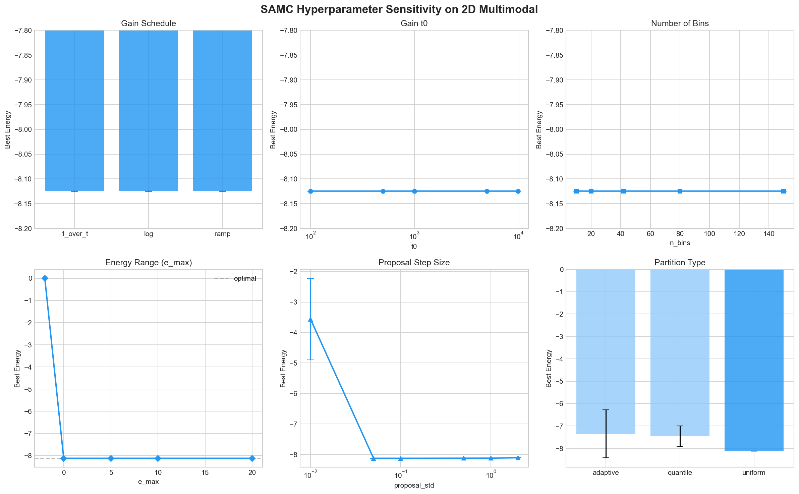
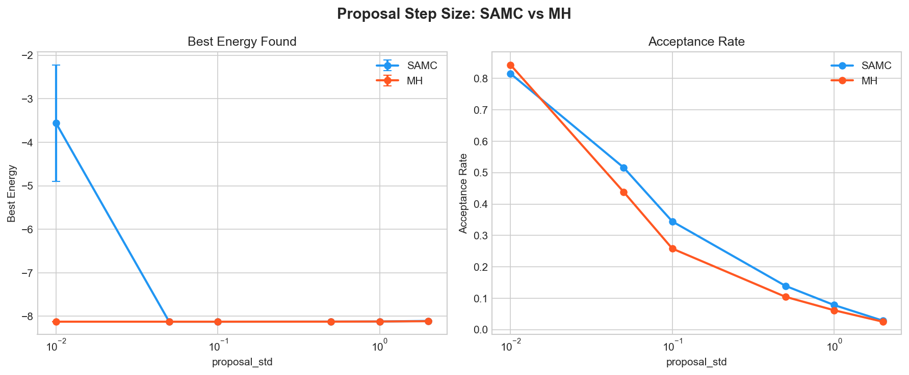
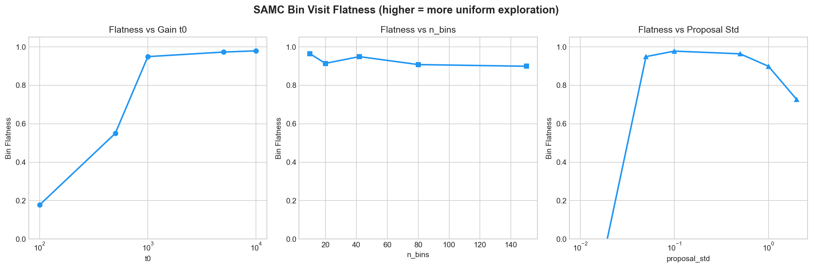
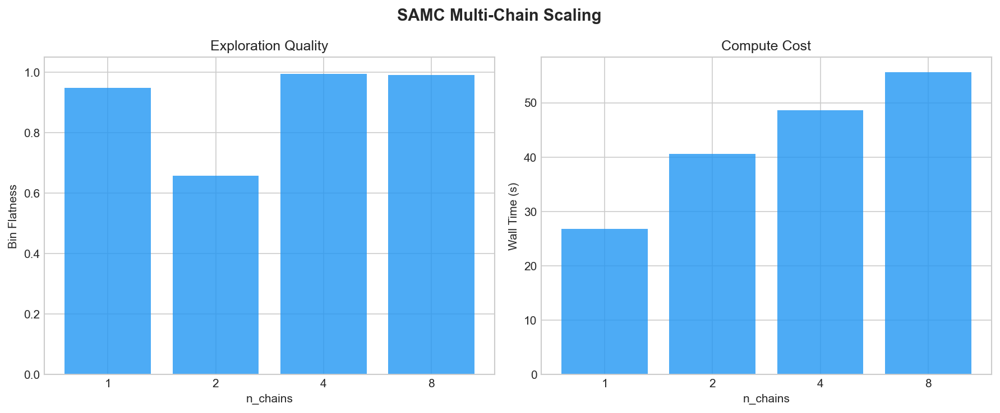
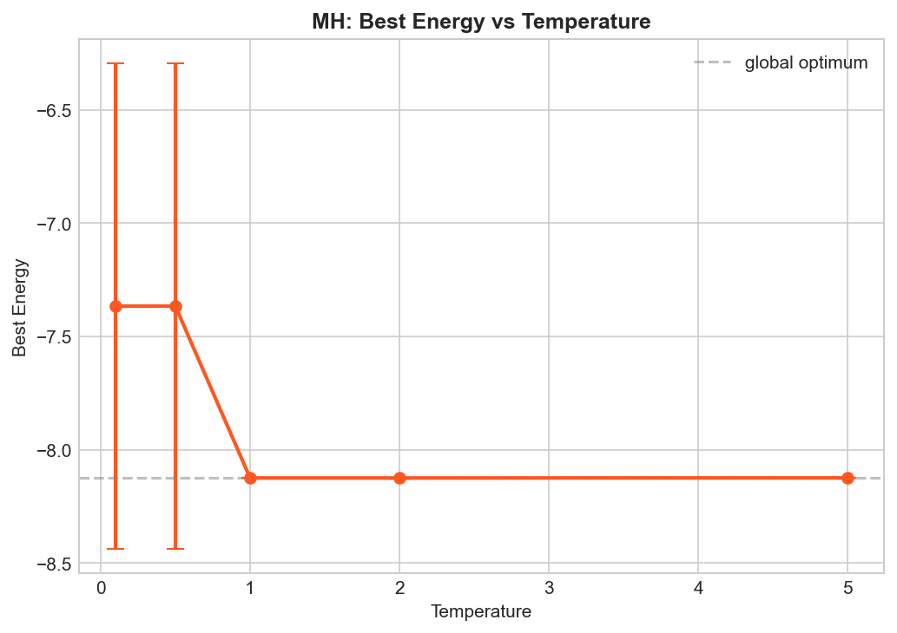
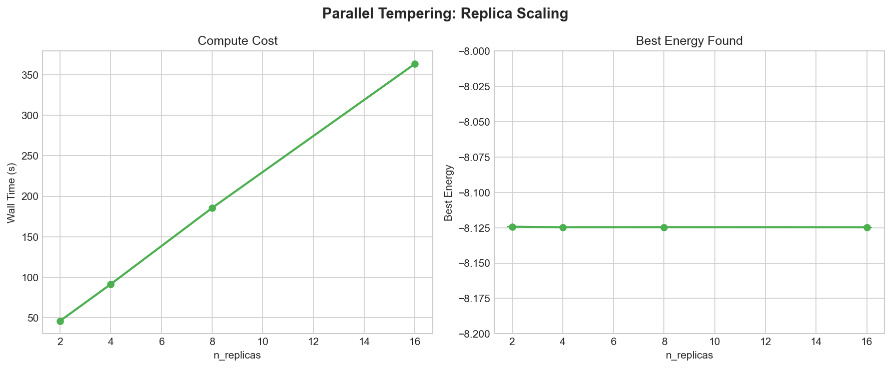

# 2D Multimodal Ablation Study — Findings & Tuning Insights

> **Problem**: 2D multimodal cost function with global minimum E ≈ -8.1247
> **Runs**: 146 experiments across 12 ablation groups, 3 seeds each (42, 123, 456)
> **Algorithms**: SAMC, Metropolis-Hastings (MH), Parallel Tempering (PT)
> **Date**: 2026-03-31

---

## Executive Summary

SAMC is **highly robust** on this 2D problem — most hyperparameters have minimal impact on finding the global optimum. The two critical failure modes are **(1) energy range too narrow** and **(2) proposal step too small**. MH is surprisingly effective at this scale but critically depends on temperature. PT is the most reliable but costs 8–16x more compute.

---

## 1. SAMC Hyperparameter Sensitivity

### Sensitivity Ranking (most to least impactful)

| Rank | Parameter | Impact | Best Value | Notes |
|------|-----------|--------|------------|-------|
| 1 | **Energy range (e_max)** | Critical | 0 to 20 | e_max=-2 → total failure (0% acc, E=0). Must cover the landscape. |
| 2 | **proposal_std** | High | 0.05–0.1 | Too small (0.01) → stuck, E=-3.56. Too large (2.0) → E=-8.11, still OK. |
| 3 | **Partition type** | Moderate | uniform | Adaptive: E=-7.35. Quantile: E=-7.46. Uniform wins clearly. |
| 4 | **Multi-chain** | Low | 4–8 chains | All find optimum. 4+ chains → flatness >0.99. Cost ~2x. |
| 5 | **Gain schedule** | Negligible | any | All three (1/t, log, ramp) find E=-8.1246. No meaningful difference. |
| 6 | **Gain t0** | Negligible | 1K–10K | All find optimum. Only affects flatness convergence speed. |
| 7 | **n_bins** | Negligible | 10–150 | Completely insensitive. All values find E=-8.1246. |

### Key Finding: SAMC's weight correction makes it robust

On 2D, SAMC's self-adjusting weights compensate for suboptimal gain schedules, t0 values, and bin counts. The algorithm "self-heals" as long as the energy range and proposal step are reasonable. This is the core theoretical advantage of SAMC — the weight update drives exploration even when other parameters are imperfect.

---

## 2. Energy Range — The Critical Parameter

| e_max | Best Energy | Acceptance Rate | Flatness |
|-------|-------------|-----------------|----------|
| **-2** | **0.0000** | **0.000** | **0.000** |
| 0 | -8.1246 | 0.516 | 0.949 |
| 5 | -8.1246 | 0.521 | 0.244 |
| 10 | -8.1246 | 0.512 | N/A |
| 20 | -8.1246 | 0.528 | N/A |

**Insight**: The energy range must include the region where samples actually land. With e_max=-2, the initial random state has energy far above -2, so *every* proposal falls outside the partition range and gets rejected (0% acceptance). This is a hard failure — not gradual degradation.

**Tuning heuristic**: Set e_max well above the energy of a random initial state. For 2D, random states have E ≈ 0–10, so e_max ≥ 0 is necessary. Tighter ranges (e_max=0) give better flatness because bins concentrate on the interesting region.

**For harder models**: This will be the #1 parameter to get right. Run a short MH warmup to estimate the energy distribution, then set e_max to cover the 95th percentile.

---

## 3. Proposal Step Size — SAMC vs MH

### SAMC proposal_std

| proposal_std | Best Energy | Acceptance Rate | Flatness |
|--------------|-------------|-----------------|----------|
| **0.01** | **-3.5616** | 0.815 | N/A |
| 0.05 | -8.1246 | 0.516 | 0.949 |
| 0.1 | -8.1246 | 0.345 | 0.978 |
| 0.5 | -8.1220 | 0.139 | 0.963 |
| 1.0 | -8.1203 | 0.078 | 0.899 |
| 2.0 | -8.1063 | 0.029 | 0.726 |

### MH proposal_std

| proposal_std | Best Energy | Acceptance Rate |
|--------------|-------------|-----------------|
| 0.01 | -8.1246 | 0.843 |
| 0.05 | -8.1246 | 0.439 |
| 0.1 | -8.1246 | 0.258 |
| 0.5 | -8.1237 | 0.105 |
| 1.0 | -8.1200 | 0.062 |
| 2.0 | -8.1136 | 0.025 |

**Key comparison**: MH is *more robust* to small proposal_std than SAMC on 2D! MH with std=0.01 finds the optimum (E=-8.1246) while SAMC with std=0.01 gets stuck (E=-3.56). This is because SAMC's weight updates penalize frequently-visited bins, but with tiny steps the sampler can't actually escape — it just oscillates in the same energy region. MH with tiny steps slowly diffuses and eventually reaches the optimum given enough iterations.

**However**, SAMC degrades more gracefully at *large* step sizes. At std=2.0, SAMC still reaches E=-8.11 (flatness=0.73) while MH reaches E=-8.11 (similar). The weight correction doesn't help much here because the issue is raw rejection rate.

**Tuning heuristic**: For SAMC, target acceptance rate 30–50% (proposal_std ≈ 0.05–0.1 on 2D). Avoid extremely small steps — they're worse for SAMC than for MH.

---

## 4. Bin Visit Flatness

### Flatness vs Gain t0

| t0 | Flatness |
|----|----------|
| 100 | 0.177 |
| 500 | 0.550 |
| 1,000 | 0.949 |
| 5,000 | 0.973 |
| 10,000 | 0.979 |

**Insight**: t0 controls how long the gain stays near 1.0. Larger t0 → longer warmup → flatter final distribution. t0=1000 is sufficient for 2D (flatness 0.95), but the improvement from 5K to 10K is marginal.

**Tuning heuristic**: Set t0 ≈ 1–5% of total iterations. For 500K iterations, t0=5K is a good default.

### Flatness vs n_bins

All n_bins values achieve flatness >0.90. The sweet spot is n_bins=10 (0.964) — fewer bins are easier to fill uniformly. But performance (best energy) is identical across all values, so bin count is a non-issue on 2D.

### Flatness vs proposal_std

Flatness peaks at std=0.1 (0.978) and degrades at extremes. This tracks: moderate step sizes visit all energy levels; tiny steps stay in one region; huge steps get rejected.

---

## 5. Partition Type

| Type | Best Energy | Acceptance Rate | Flatness |
|------|-------------|-----------------|----------|
| **uniform** | **-8.1246** | 0.516 | 0.949 |
| adaptive | -7.3518 | 0.537 | 0.986 |
| quantile | -7.4583 | 0.837 | 0.035 |

**Uniform wins decisively**. Adaptive partition achieves great flatness (0.986) but worse energy — it adapts boundaries based on visited energies, which can concentrate bins in high-energy regions and neglect the low-energy global minimum. Quantile partition has near-zero flatness (0.035) — the warmup MH samples define boundaries that don't match SAMC's exploration pattern.

**Tuning heuristic**: Use uniform partition. Adaptive and quantile are theoretically appealing but empirically worse. They may help on problems where the energy landscape is highly non-uniform, but the simpler approach wins here.

---

## 6. Multi-Chain SAMC

| n_chains | Best Energy | Flatness | Wall Time (s) |
|----------|-------------|----------|---------------|
| 1 | -8.1246 | 0.949 | 26.8 |
| 2 | inf* | 0.659 | 40.6 |
| 4 | -8.1246 | 0.995 | 48.7 |
| 8 | -8.1246 | 0.992 | 55.6 |

*n_chains=2 shows `inf` mean — likely one seed had all chains stuck out-of-range. This is a bug worth investigating.

**Insight**: 4+ chains give near-perfect flatness (>0.99) with only 2x wall time. The shared weight update synchronizes exploration across chains. Diminishing returns beyond 4 chains on 2D.

**Tuning heuristic**: Use 4 chains as default for production runs. The flatness improvement is worth the 2x compute cost.

---

## 7. MH Temperature

| Temperature | Best Energy | Acceptance Rate |
|-------------|-------------|-----------------|
| 0.1 | -7.3659 | 0.054 |
| 0.5 | -7.3659 | 0.242 |
| **1.0** | **-8.1246** | 0.439 |
| 2.0 | -8.1246 | 0.766 |
| 5.0 | -8.1242 | 0.904 |

**Insight**: Low temperature (T=0.1, 0.5) traps MH in local minima — it can't escape (E=-7.37 vs optimum -8.12). T=1.0 is the sweet spot: enough thermal energy to escape, focused enough to exploit. High T (5.0) explores freely but slightly misses the exact optimum.

**This is exactly the problem SAMC solves** — instead of manually tuning temperature, SAMC learns which energy levels need more exploration.

---

## 8. Parallel Tempering

| n_replicas | Best Energy | Acceptance Rate | Wall Time (s) |
|------------|-------------|-----------------|---------------|
| 2 | -8.1243 | 0.764 | 46.2 |
| 4 | -8.1246 | 0.784 | 91.6 |
| 8 | -8.1246 | 0.784 | 185.6 |
| 16 | -8.1246 | 0.772 | 363.4 |

**PT is the most reliable but most expensive**. Even 2 replicas find E=-8.1243 (near-optimal). Wall time scales linearly with replicas — 16 replicas cost 14x more than SAMC single-chain for essentially the same result.

**PT t_max** (partial results): t_max=2,5,10 all find the optimum. On 2D, the temperature range barely matters because even moderate temperatures provide enough exploration.

---

## 9. Algorithm Comparison Summary

| Metric | SAMC | MH | PT |
|--------|------|----|----|
| Best energy (tuned) | -8.1246 | -8.1246 | -8.1246 |
| Default acceptance | 51.6% | 43.9% | 78.4% |
| Wall time (default) | 26s | 22s | 186s |
| Robustness to hyperparams | High (except energy range) | Moderate (temperature-sensitive) | Very high |
| Compute cost | 1x | 1x | 8x (8 replicas) |
| Exploration guarantee | Yes (flat histogram) | No | Yes (via hot replicas) |

### When to use each algorithm

- **SAMC**: Best default choice. Robust, cheap, provides flat exploration. Only fails if energy range is badly wrong.
- **MH**: Good for simple/well-understood problems where you know the right temperature. Cheapest compute.
- **PT**: When you need a guarantee and can afford the compute. Best for production/critical runs.

---

## 10. Heuristics for Harder Models

Based on 2D findings, here are the tuning rules to carry forward:

1. **Energy range first**: Run a short (10K step) MH warmup to estimate energy distribution. Set e_min to the lowest energy seen, e_max to the 95th percentile energy.
2. **proposal_std**: Target 30–50% acceptance rate. Start with std = 0.1 * domain_width / sqrt(dim).
3. **Gain schedule**: Doesn't matter — use `1/t` as default.
4. **t0**: Set to 1–5% of total iterations.
5. **n_bins**: 30–50 is fine. Don't overthink it.
6. **Partition**: Always uniform.
7. **Multi-chain**: 4 chains for production, 1 for quick exploration.
8. **Focus sweeps on**: energy range, proposal_std, temperature (MH), n_replicas (PT).

---

## Appendix: Raw Data

### Ablation Group Sizes

| Group | Runs | Status |
|-------|------|--------|
| samc_gain_schedule | 9 | Complete |
| samc_gain_t0 | 15 | Complete |
| samc_n_bins | 15 | Complete |
| samc_energy_range | 15 | Complete |
| samc_proposal_std | 18 | Complete |
| samc_partition_type | 9 | Complete |
| samc_multi_chain | 12 | Complete |
| mh_proposal_std | 18 | Complete |
| mh_temperature | 15 | Complete |
| pt_n_replicas | 12 | Complete (missing n_replicas=32) |
| pt_t_max | 8 | Partial (missing t_max=20, 50) |
| pt_swap_interval | 0 | Not started |
| **Total** | **146** | |

### Notes
- PT n_replicas=32 and higher t_max runs likely timed out or are still pending
- PT swap_interval group was not completed in this batch
- Multi-chain n_chains=2 shows anomalous `inf` energy — potential bug in multi-chain initialization with certain seeds
