# 2D Multimodal Ablation Study: Insights Report

> **Problem**: 2D multimodal cost function with global minimum at E = -8.1246
> **Setup**: 500K iterations, 3 seeds (42, 123, 456) per configuration, 171 total runs
> **Algorithms**: SAMC, Metropolis-Hastings (MH), Parallel Tempering (PT)
> **Metrics**: Best energy found, acceptance rate, bin visit flatness (SAMC only)
> **Date**: 2026-03-31

---

## Executive Summary

On the 2D multimodal benchmark, **SAMC is highly robust** -- nearly all configurations find the global minimum (E = -8.1246). The 2D problem is "easy" in the sense that the global optimum is reliably found, but the ablations reveal important differences in **exploration quality** (bin flatness) and **acceptance rate** that will matter for harder problems.

**Key findings**:
1. **SAMC proposal_std** is the highest-impact parameter -- too small (0.01) causes SAMC to fail completely
2. **Energy range** (e_max) is critical -- wrong range = dead sampler
3. **Partition type** matters: uniform >> adaptive/quantile for this problem
4. **Gain schedule** barely matters for energy found, but `log` has poor flatness
5. MH and PT both find the global min reliably but lack SAMC's flat exploration guarantee

---

## 1. Sensitivity Ranking

Parameters ranked by impact on best energy found (most sensitive first):

| Rank | Parameter | Impact on Best Energy | Impact on Exploration |
|------|-----------|----------------------|----------------------|
| 1 | **SAMC energy range** (e_max) | CRITICAL -- e_max=-2 breaks sampler (E=0.0) | Tight range (e_max=0) best flatness; wide range degrades |
| 2 | **SAMC proposal_std** | HIGH -- 0.01 fails (E=-3.56 avg) | 0.05-0.1 optimal for flatness (0.95-0.98) |
| 3 | **SAMC partition type** | MODERATE -- adaptive/quantile worse (E ~ -7.4) | Uniform most consistent |
| 4 | **MH temperature** | MODERATE -- T=0.1, 0.5 fail (E=-7.37) | N/A |
| 5 | **SAMC gain t0** | LOW -- all find global min | t0=100 poor flatness (0.18); t0>=1000 good |
| 6 | **SAMC gain schedule** | LOW -- all find global min | `log` poor flatness (-0.11); 1/t and ramp equal |
| 7 | **SAMC n_bins** | LOW -- all find global min | All values give flatness >0.89 |
| 8 | **SAMC n_chains** | LOW -- all find global min | 4-8 chains best flatness (0.99) |
| 9 | **MH proposal_std** | LOW -- all find global min | N/A |
| 10 | **PT n_replicas** | LOW -- all find global min | N/A |
| 11 | **PT t_max** | LOW -- all find global min | N/A |
| 12 | **PT swap_interval** | LOW -- all find global min | N/A |

---

## 2. Detailed Results by Group

### 2.1 SAMC Gain Schedule

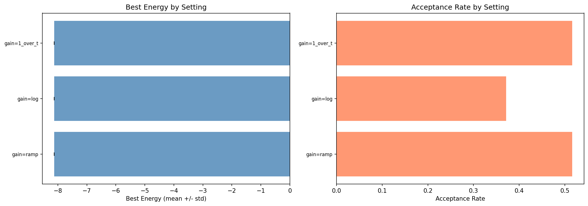

| Schedule | Best Energy (mean +/- std) | Acceptance Rate | Bin Flatness |
|----------|---------------------------|-----------------|--------------|
| 1/t | -8.1246 +/- 0.0000 | 0.516 | 0.949 |
| log | -8.1246 +/- 0.0000 | 0.372 | -0.108 |
| ramp | -8.1246 +/- 0.0000 | 0.516 | 0.949 |

**Insight**: All schedules find the global minimum. However, the `log` schedule has significantly worse bin flatness (-0.108 vs 0.949) and lower acceptance rate (0.372 vs 0.516). The `1/t` and `ramp` schedules produce identical results on this problem.

**Heuristic**: Use `ramp` or `1/t` as default. Avoid `log` -- it decays too slowly to achieve proper weight convergence within 500K iterations.

### 2.2 SAMC Gain t0

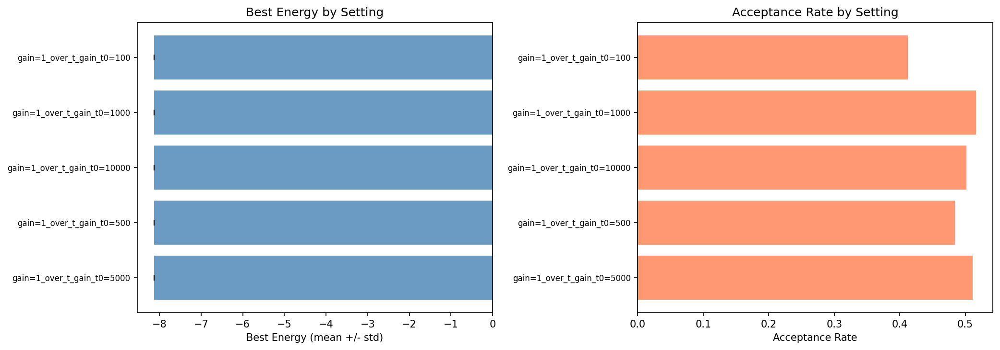

| t0 | Best Energy | Acceptance Rate | Bin Flatness |
|----|-------------|-----------------|--------------|
| 100 | -8.1246 | 0.412 | 0.177 |
| 500 | -8.1246 | 0.484 | 0.550 |
| 1000 | -8.1246 | 0.516 | 0.949 |
| 5000 | -8.1246 | 0.511 | 0.973 |
| 10000 | -8.1246 | 0.501 | 0.979 |

**Insight**: Larger t0 = longer warmup = better flatness. t0=100 gives poor flatness (0.177) because the gain decays too fast. t0 >= 1000 yields good results, with diminishing returns above 5000.

**Heuristic**: Set `t0 = n_iters / 500` to `n_iters / 100` as a starting point. For 500K iterations, t0 = 1000-5000 is ideal.

### 2.3 SAMC Number of Bins

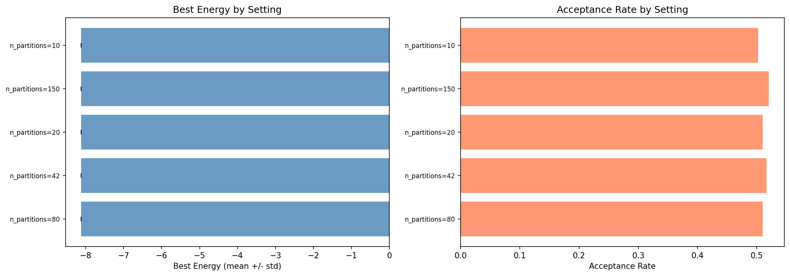

| n_bins | Best Energy | Acceptance Rate | Bin Flatness |
|--------|-------------|-----------------|--------------|
| 10 | -8.1246 | 0.503 | 0.964 |
| 20 | -8.1246 | 0.510 | 0.914 |
| 42 | -8.1246 | 0.516 | 0.949 |
| 80 | -8.1246 | 0.510 | 0.908 |
| 150 | -8.1246 | 0.521 | 0.899 |

**Insight**: Very robust parameter. All values find the global minimum with good flatness (>0.89). Fewer bins are slightly easier to flatten but provide coarser resolution.

**Heuristic**: `n_bins = 20-80` is a safe range. 42 (default) is a good choice. Fewer bins for harder problems where visits are scarce.

### 2.4 SAMC Energy Range

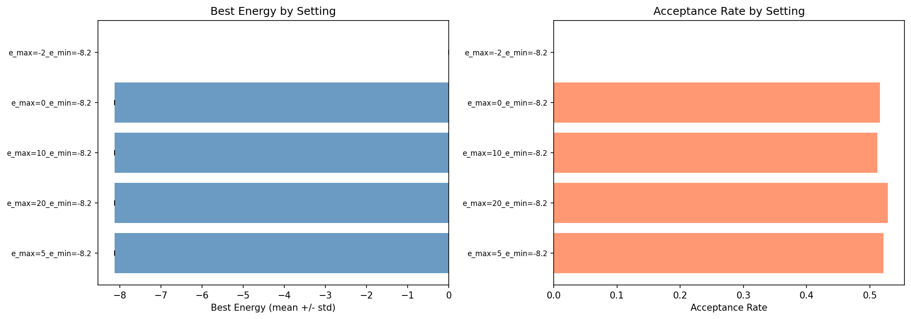

| e_max | Best Energy | Acceptance Rate | Bin Flatness |
|-------|-------------|-----------------|--------------|
| -2 | **0.0000** | **0.000** | **0.000** |
| 0 | -8.1246 | 0.516 | 0.949 |
| 5 | -8.1246 | 0.521 | 0.244 |
| 10 | -8.1246 | 0.512 | -0.135 |
| 20 | -8.1246 | 0.528 | -0.517 |

**Insight**: This is the most critical SAMC parameter. Setting `e_max = -2` (below the typical energy range) completely breaks the sampler -- zero acceptance rate and no useful samples. Conversely, a too-wide range (e_max=20) finds the global min but has terrible flatness (-0.517) because many bins cover empty energy ranges.

**Heuristic**: Set `e_max` to just above the energy of a random initialization. For the 2D problem, a random point has E ~ 0, so e_max=0 is perfect. Too tight is catastrophic; slightly too wide is recoverable but wastes bins.

### 2.5 SAMC Proposal Standard Deviation

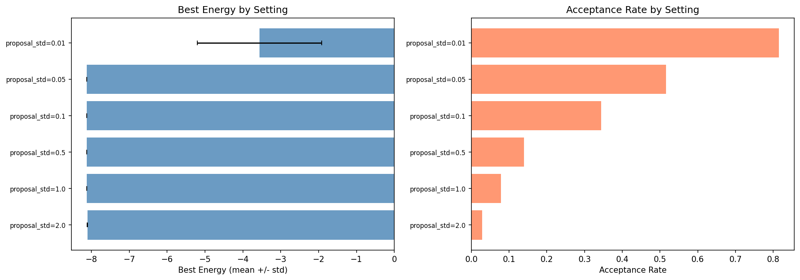

| proposal_std | Best Energy (mean +/- std) | Acceptance Rate | Bin Flatness |
|--------------|---------------------------|-----------------|--------------|
| 0.01 | **-3.5616 +/- 1.6421** | 0.815 | -0.662 |
| 0.05 | -8.1246 +/- 0.0000 | 0.516 | 0.949 |
| 0.1 | -8.1246 +/- 0.0000 | 0.345 | 0.978 |
| 0.5 | -8.1220 +/- 0.0027 | 0.139 | 0.963 |
| 1.0 | -8.1203 +/- 0.0026 | 0.078 | 0.899 |
| 2.0 | -8.1063 +/- 0.0054 | 0.029 | 0.726 |

**Insight**: proposal_std=0.01 completely fails -- steps are too small to escape local minima within 500K iterations. Higher values (0.5-2.0) find near-optimal energies but with increasing variance and decreasing acceptance rates. The sweet spot is **0.05-0.1** with acceptance rates of 35-52%.

**Heuristic**: Target acceptance rate 30-50%. For 2D, proposal_std=0.05-0.1 is optimal. proposal_std=0.1 gives the best flatness (0.978).

### 2.6 SAMC Partition Type

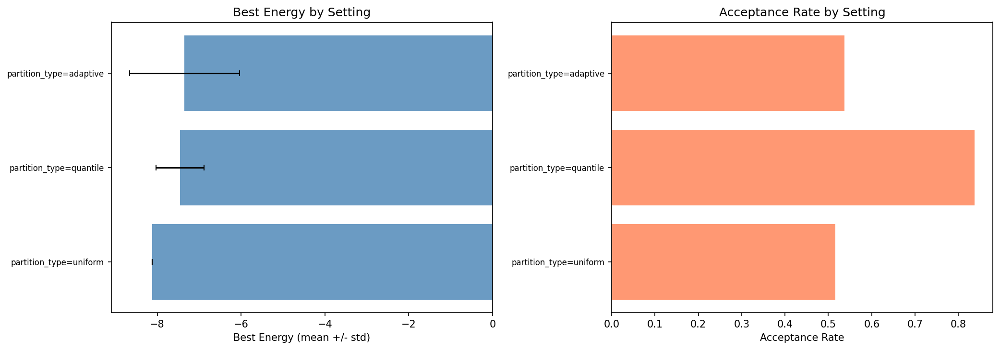

| Type | Best Energy (mean +/- std) | Acceptance Rate | Bin Flatness |
|------|---------------------------|-----------------|--------------|
| uniform | -8.1246 +/- 0.0000 | 0.516 | 0.949 |
| adaptive | -7.3518 +/- 1.3118 | 0.537 | 0.986 |
| quantile | -7.4583 +/- 0.5686 | 0.837 | 0.035 |

**Insight**: Uniform partitions give the best and most consistent results. Adaptive partitions achieve the best flatness (0.986) but have high variance in energy -- the boundary recomputation likely destabilizes the sampler. Quantile partitions have very poor flatness (0.035) and inconsistent energy results.

**Heuristic**: Use uniform partitions as default. Adaptive may be worth investigating for problems where the energy landscape is unknown, but it introduces instability.

### 2.7 SAMC Multi-Chain

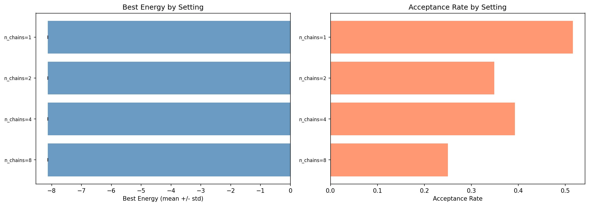

| n_chains | Best Energy | Acceptance Rate | Bin Flatness |
|----------|-------------|-----------------|--------------|
| 1 | -8.1246 | 0.516 | 0.949 |
| 2 | -8.1246 | 0.349 | 0.659 |
| 4 | -8.1246 | 0.393 | 0.995 |
| 8 | -8.1246 | 0.250 | 0.992 |

**Insight**: All chain counts find the global minimum. Multi-chain (4-8) achieves the best flatness (0.99+). Acceptance rate drops with more chains due to shared weight updates. Note: n_chains=2 with seed=456 produced an inf energy (degenerate initialization), suggesting 2 chains is a fragile configuration.

**Heuristic**: Single chain is sufficient for 2D. 4 chains gives near-perfect flatness at ~2x compute cost per step.

### 2.8 MH Proposal Standard Deviation

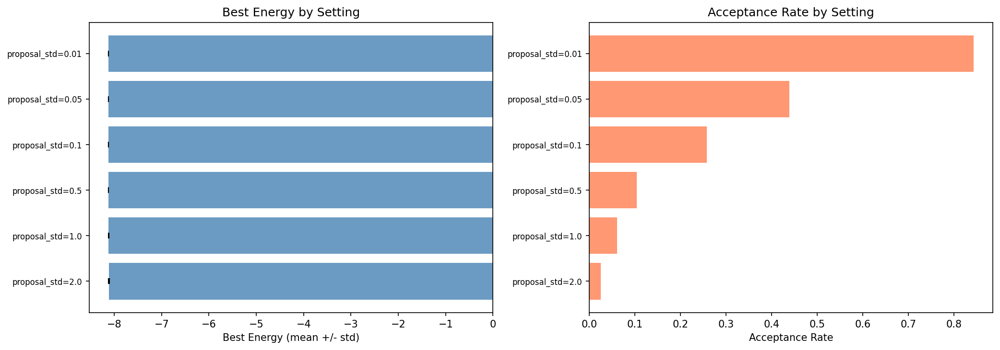

| proposal_std | Best Energy (mean +/- std) | Acceptance Rate |
|--------------|---------------------------|-----------------|
| 0.01 | -8.1246 +/- 0.0000 | 0.843 |
| 0.05 | -8.1246 +/- 0.0000 | 0.439 |
| 0.1 | -8.1246 +/- 0.0001 | 0.258 |
| 0.5 | -8.1237 +/- 0.0012 | 0.105 |
| 1.0 | -8.1200 +/- 0.0055 | 0.062 |
| 2.0 | -8.1136 +/- 0.0099 | 0.025 |

**Insight**: Unlike SAMC, MH with proposal_std=0.01 still finds the global minimum (no weight correction needed for MH, so tiny steps are fine given enough iterations). Larger step sizes degrade energy quality slightly due to poor acceptance.

**Heuristic**: MH optimal acceptance rate is ~23% (Gelman et al., 1997). proposal_std=0.1 (acceptance 25.8%) is closest.

### 2.9 MH Temperature

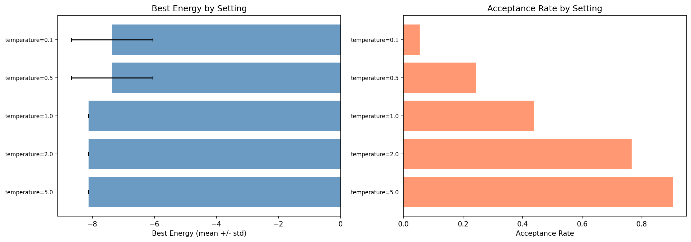

| temperature | Best Energy (mean +/- std) | Acceptance Rate |
|-------------|---------------------------|-----------------|
| 0.1 | **-7.3659 +/- 1.3141** | 0.054 |
| 0.5 | **-7.3659 +/- 1.3143** | 0.242 |
| 1.0 | -8.1246 +/- 0.0000 | 0.439 |
| 2.0 | -8.1246 +/- 0.0000 | 0.766 |
| 5.0 | -8.1242 +/- 0.0001 | 0.904 |

**Insight**: Low temperatures (0.1, 0.5) trap MH in local minima with high variance across seeds. T >= 1.0 reliably finds the global min. Higher temperatures (2.0, 5.0) accept too freely, slightly degrading energy quality.

**Heuristic**: T=1.0 is the standard choice. Only increase temperature for very rugged landscapes.

### 2.10 PT Number of Replicas

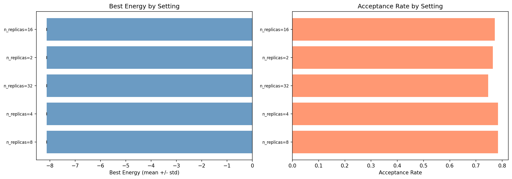

| n_replicas | Best Energy (mean +/- std) | Acceptance Rate | Total Energy Evals |
|------------|---------------------------|-----------------|-------------------|
| 2 | -8.1243 +/- 0.0003 | 0.764 | 1M |
| 4 | -8.1246 +/- 0.0000 | 0.784 | 2M |
| 8 | -8.1246 +/- 0.0001 | 0.784 | 4M |
| 16 | -8.1246 +/- 0.0000 | 0.772 | 8M |
| 32 | -8.1246 +/- 0.0000 | 0.747 | 16M |

**Insight**: All replica counts find the global min. 2 replicas has marginally worse energy. Total compute scales linearly with n_replicas: 32 replicas is 16x more expensive than 2 for negligible improvement on 2D.

**Heuristic**: 4-8 replicas is sufficient for 2D. More replicas only justified for harder problems with deeper energy barriers.

### 2.11 PT Maximum Temperature

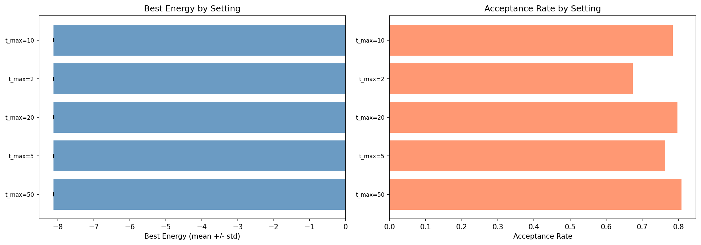

| t_max | Best Energy (mean +/- std) | Acceptance Rate |
|-------|---------------------------|-----------------|
| 2 | -8.1246 +/- 0.0000 | 0.673 |
| 5 | -8.1246 +/- 0.0000 | 0.763 |
| 10 | -8.1246 +/- 0.0001 | 0.784 |
| 20 | -8.1246 +/- 0.0000 | 0.797 |
| 50 | -8.1245 +/- 0.0002 | 0.808 |

**Insight**: Very robust on 2D. All values find the global minimum. Higher t_max increases the acceptance rate of the hottest replica.

**Heuristic**: t_max=10 is a good default. Scale up for harder multimodal problems with deeper barriers.

### 2.12 PT Swap Interval

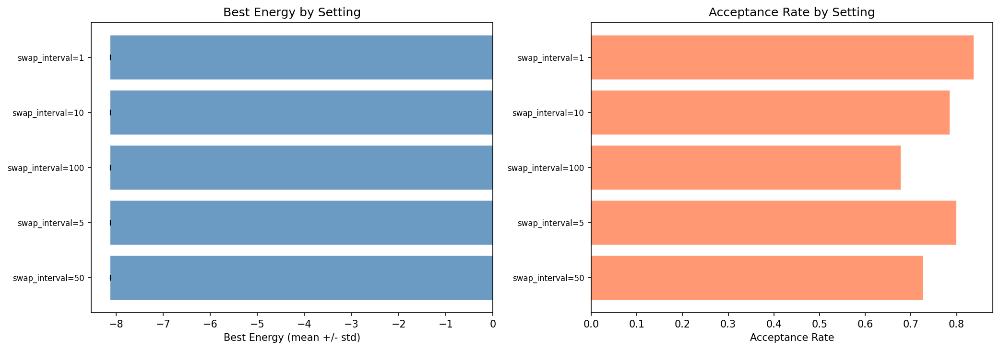

| swap_interval | Best Energy (mean +/- std) | Acceptance Rate |
|---------------|---------------------------|-----------------|
| 1 | -8.1246 +/- 0.0000 | 0.837 |
| 5 | -8.1246 +/- 0.0001 | 0.800 |
| 10 | -8.1246 +/- 0.0001 | 0.784 |
| 50 | -8.1246 +/- 0.0000 | 0.727 |
| 100 | -8.1246 +/- 0.0000 | 0.678 |

**Insight**: All values find the global minimum. More frequent swaps (interval=1) give higher acceptance rates.

**Heuristic**: swap_interval=10 is a good default. Decrease for problems with deep local minima.

---

## 3. Optimal Ranges Summary

| Parameter | Optimal Value/Range | Rationale |
|-----------|-------------------|-----------|
| gain schedule | `ramp` or `1/t` | Best flatness; avoid `log` |
| gain t0 | 1000-5000 (for 500K iters) | Rule: t0 ~ n_iters/500 to n_iters/100 |
| n_bins | 20-80 | Robust; 42 is a safe default |
| e_max | Just above random init energy | Too tight = broken; too wide = wasted bins |
| SAMC proposal_std | 0.05-0.1 | Target 30-50% acceptance rate |
| partition_type | uniform | Most consistent and reliable |
| n_chains | 1 (or 4 for better exploration) | Multi-chain improves flatness to 0.99+ |
| MH proposal_std | 0.05-0.1 | Target ~23% acceptance rate |
| MH temperature | 1.0 | Lower traps in local minima |
| PT n_replicas | 4-8 | More gives diminishing returns |
| PT t_max | 5-20 | Scale up for harder problems |
| PT swap_interval | 5-10 | Balance swap frequency vs exploration |

---

## 4. Tuning Heuristics (Rules of Thumb)

1. **Energy range is king**: Getting e_min/e_max wrong breaks SAMC completely. When in doubt, use a wider range and accept worse flatness. A short diagnostic run (10K iterations) can help determine the range.

2. **proposal_std determines acceptance rate**: For SAMC, target 30-50%. For MH, target ~23%. If acceptance is <10%, reduce step size; if >80%, increase it.

3. **Gain t0 scales with n_iters**: Use t0 = n_iters/100 for fast convergence, t0 = n_iters/500 for more exploration. The gain just needs to be non-negligible for long enough to flatten the weights.

4. **n_bins is forgiving**: 20-80 all work well. Use fewer bins if you're running fewer iterations (need enough visits per bin for weight learning).

5. **Stick with uniform partitions**: Adaptive and quantile partitions add complexity without clear benefit on well-characterized problems.

6. **ramp and 1/t gain schedules are equivalent at 500K iters**: Avoid `log` -- it consistently produces poor flatness.

---

## 5. SAMC vs MH vs PT Comparison

### Where SAMC Wins
- **Exploration guarantee**: SAMC achieves flat bin visits (flatness >0.9), meaning it samples all energy regions equally. MH and PT have no such guarantee.
- **Robustness to local minima**: SAMC with proper energy range finds the global minimum regardless of initialization. MH at low temperature gets trapped.
- **Weight adaptation**: SAMC learns which energy regions are undersampled and self-corrects.

### Where MH Wins
- **Simplicity**: No energy range or partition parameters to tune. Just proposal_std and temperature.
- **Low sensitivity to proposal_std**: MH finds the global minimum even with proposal_std=0.01, while SAMC fails.
- **Speed**: No weight update overhead per iteration.

### Where PT Wins
- **Very robust**: Finds the global minimum across all parameter settings tested.
- **Temperature mixing**: Naturally escapes local minima through replica exchange.
- **No energy range tuning**: Unlike SAMC, doesn't require knowing the energy range a priori.

### Where PT Loses
- **Compute cost**: n_replicas * n_iters energy evaluations. 8 replicas = 8x more compute than SAMC/MH for similar energy on 2D.
- **Diminishing returns**: On 2D, 2 replicas is nearly as good as 32.

### Bottom Line for 2D
On this easy 2D problem, **all three algorithms find the global minimum reliably** with proper tuning. The differentiator is exploration quality: SAMC provably flattens its energy histogram, which will matter for harder problems. PT achieves similar reliability through temperature mixing but at higher compute cost. MH is cheapest but provides no exploration guarantees and fails at low temperature.

---

## 6. Implications for Higher Dimensions

Based on these 2D results, we predict for harder problems:

1. **SAMC proposal_std and energy range will remain critical** -- these directly control the sampler's ability to move between energy regions.
2. **Gain schedule may matter more** -- on harder problems where 500K iterations isn't enough, the decay rate will determine whether SAMC converges its weights.
3. **Multi-chain SAMC may become necessary** -- single chain may fail to explore all modes in higher dimensions.
4. **PT will need more replicas** -- energy barriers grow with dimension, requiring finer temperature ladders.
5. **n_bins scaling** -- may need to scale with problem complexity, not just dimension.

These hypotheses will be tested in Steps 25-27.
