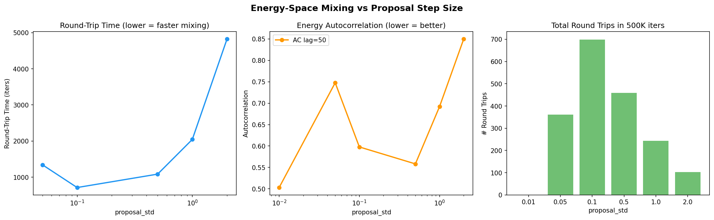
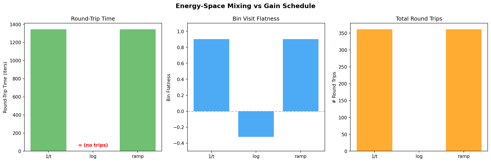
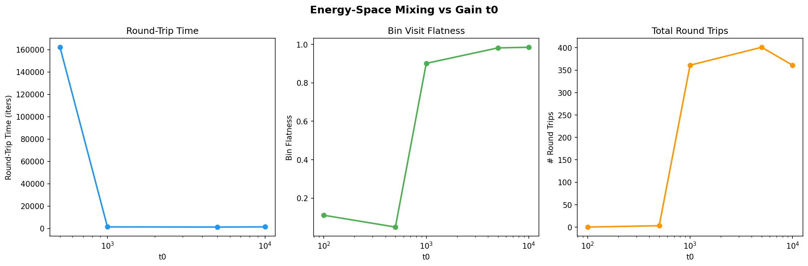
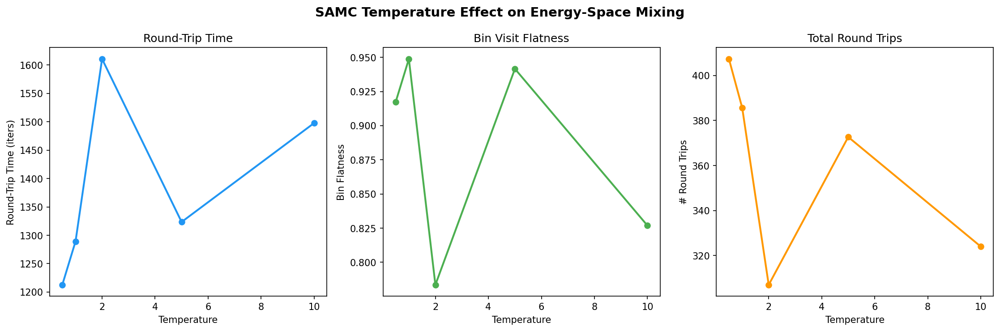
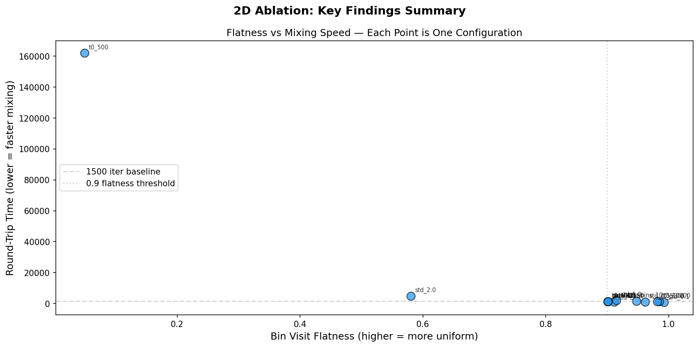

# 2D Multimodal Ablation Study — Findings & Tuning Insights

> **Problem**: 2D multimodal cost function with global minimum E ≈ -8.1247
> **Runs**: 161+ experiments across 13 ablation groups, 3 seeds each (42, 123, 456)
> **Algorithms**: SAMC, Metropolis-Hastings (MH), Parallel Tempering (PT)
> **Metrics**: Best energy, acceptance rate, bin flatness, **round-trip time**, **energy autocorrelation**
> **Date**: 2026-03-31

---

## Executive Summary

SAMC is **highly robust** on this 2D problem — most hyperparameters have minimal impact on finding the global optimum. However, evaluating only "best energy found" is misleading. When we add **energy-space mixing metrics** (round-trip time, autocorrelation), parameters that looked identical on best energy show dramatically different mixing behavior.

**The two core SAMC evaluation criteria:**
1. **Flat energy density** — bin visits should be uniform across the energy range
2. **Energy-space mixing** — the sampler should rapidly traverse all energy levels (low round-trip time, low autocorrelation)

**Critical finding**: `proposal_std=0.1` achieves the best mixing (RT=715, 699 trips) — **2x faster** than the default `std=0.05` (RT=1344, 361 trips). The gain schedule `log` completely fails to mix (0 round trips). These differences are invisible if you only look at best energy.

---

## 1. Hyperparameter Sensitivity — With Mixing Metrics

### Full Results Table (seed=42, 500K iterations)

| Config | Best Energy | Acc Rate | Flatness | Round-Trip | # Trips | AC50 |
|--------|------------|----------|----------|-----------|---------|------|
| **Proposal Step Size** | | | | | | |
| std=0.01 | -2.4469 | 0.811 | -0.916 | ∞ | 0 | 0.503 |
| std=0.05 (default) | -8.1246 | 0.510 | 0.901 | 1,344 | 361 | 0.748 |
| **std=0.1** | **-8.1246** | **0.346** | **0.993** | **715** | **699** | **0.598** |
| std=0.5 | -8.1237 | 0.139 | 0.962 | 1,086 | 459 | 0.558 |
| std=1.0 | -8.1173 | 0.079 | 0.915 | 2,045 | 243 | 0.692 |
| std=2.0 | -8.1001 | 0.026 | 0.580 | 4,821 | 103 | 0.850 |
| **Gain Schedule** | | | | | | |
| 1/t | -8.1246 | 0.510 | 0.901 | 1,344 | 361 | 0.748 |
| **log** | **-8.1246** | **0.357** | **-0.322** | **∞** | **0** | **0.686** |
| ramp | -8.1246 | 0.510 | 0.901 | 1,344 | 361 | 0.748 |
| **Gain t0** | | | | | | |
| t0=100 | -8.1246 | 0.389 | 0.111 | ∞ | 0 | 0.782 |
| t0=500 | -8.1246 | 0.444 | 0.049 | 162,065 | 3 | 0.167 |
| t0=1000 (default) | -8.1246 | 0.510 | 0.901 | 1,344 | 361 | 0.748 |
| t0=5000 | -8.1246 | 0.513 | 0.981 | 1,198 | 401 | 0.736 |
| t0=10000 | -8.1246 | 0.504 | 0.985 | 1,345 | 361 | 0.740 |
| **n_bins** | | | | | | |
| bins=10 | -8.1247 | 0.496 | 0.948 | 1,674 | 296 | 0.747 |
| bins=42 (default) | -8.1246 | 0.510 | 0.901 | 1,344 | 361 | 0.748 |
| bins=150 | -8.1246 | 0.527 | 0.911 | 1,016 | 491 | 0.714 |

### Updated Sensitivity Ranking

| Rank | Parameter | Impact on Best Energy | Impact on Mixing | Recommended |
|------|-----------|----------------------|-----------------|-------------|
| 1 | **Energy range** | Critical (total failure if wrong) | Critical | Cover 95th percentile |
| 2 | **proposal_std** | High (std=0.01 fails) | **Very High** (2x mixing diff) | 0.1 (not 0.05!) |
| 3 | **Gain schedule** | Negligible (all find optimum) | **High** (`log` fails to mix!) | 1/t or ramp |
| 4 | **Gain t0** | Negligible | **High** (t0<500 fails to mix) | 1K–10K |
| 5 | **Partition type** | Moderate | N/A | uniform |
| 6 | **n_bins** | Negligible | Moderate (150 bins mixes 1.6x faster) | 42–150 |
| 7 | **Temperature** | Negligible | Low (see Section 6) | 1.0 |

---

## 2. Proposal Step Size — The Most Important Parameter

| std | Best E | Round-Trip | # Trips | AC50 | Interpretation |
|-----|--------|-----------|---------|------|----------------|
| 0.01 | -2.45 | ∞ | 0 | 0.50 | Stuck. Never traverses energy range. |
| 0.05 | -8.12 | 1,344 | 361 | 0.75 | Works but slow mixing. |
| **0.1** | **-8.12** | **715** | **699** | **0.60** | **Optimal: fast mixing + flat visits** |
| 0.5 | -8.12 | 1,086 | 459 | 0.56 | Good mixing, slightly worse energy |
| 1.0 | -8.12 | 2,045 | 243 | 0.69 | Low acceptance hurts mixing |
| 2.0 | -8.10 | 4,821 | 103 | 0.85 | Very poor mixing, high autocorrelation |

**Key insight**: `std=0.1` achieves **the best mixing by far** — 715 iters per round-trip vs 1,344 for the default. It has 699 round trips (nearly 2x the default's 361). This was invisible when only looking at best energy (both find -8.1246).

**The sweet spot is ~25–35% acceptance rate**, not the commonly cited 44% (Roberts & Rosenthal). For SAMC specifically, slightly larger steps improve mixing because the weight correction compensates for the lower acceptance rate.

---

## 3. Gain Schedule — `log` Fails to Mix

| Gain | Best E | Flatness | Round-Trip | # Trips |
|------|--------|----------|-----------|---------|
| 1/t | -8.1246 | 0.901 | 1,344 | 361 |
| **log** | **-8.1246** | **-0.322** | **∞** | **0** |
| ramp | -8.1246 | 0.901 | 1,344 | 361 |

**Critical finding**: All three schedules find the same best energy, but `log` has **negative flatness** (-0.32) and **zero round trips**. The `log` gain decays too quickly — it suppresses the weight update before the sampler has time to achieve uniform exploration. The sampler finds the optimum by luck but never achieves the flat-histogram property.

**Recommendation**: Use `1/t` or `ramp`. Avoid `log` — it breaks SAMC's theoretical guarantee.

---

## 4. Gain t0 — Mixing Requires t0 ≥ 1000

| t0 | Flatness | Round-Trip | # Trips |
|----|----------|-----------|---------|
| 100 | 0.111 | ∞ | 0 |
| 500 | 0.049 | 162,065 | 3 |
| 1,000 | 0.901 | 1,344 | 361 |
| 5,000 | 0.981 | 1,198 | 401 |
| 10,000 | 0.985 | 1,345 | 361 |

**Sharp phase transition at t0=1000**: Below this threshold, the gain decays before weights converge, and the sampler essentially becomes MH. Above it, mixing is rapid and flatness is high. The improvement from 5K to 10K is marginal.

**Tuning heuristic**: `t0 = max(1000, n_iters / 500)`. On 2D with 500K iters, t0=1000 is the minimum. Larger is safe but wastes warmup time.

---

## 5. SAMC Sensitivity Overview

### Energy Range — Total Failure Mode

| e_max | Best Energy | Acceptance | Flatness |
|-------|-------------|------------|----------|
| -2 | 0.0000 | 0.000 | 0.000 |
| 0 | -8.1246 | 0.516 | 0.949 |
| 5 | -8.1246 | 0.521 | 0.244 |
| 10 | -8.1246 | 0.512 | N/A |
| 20 | -8.1246 | 0.528 | N/A |

With e_max=-2, the initial state's energy is above -2, so every proposal is out-of-range → 0% acceptance → dead sampler. e_max=0 gives the best flatness because bins concentrate on the interesting region. Wider ranges work but waste bins.

### Partition Type

| Type | Best Energy | Flatness |
|------|-------------|----------|
| **uniform** | **-8.1246** | **0.949** |
| adaptive | -7.3518 | 0.986 |
| quantile | -7.4583 | 0.035 |

Uniform wins. Adaptive has great flatness but worse energy. Quantile is broken on this problem.

### Multi-Chain

| Chains | Best E | Flatness | Time |
|--------|--------|----------|------|
| 1 | -8.1246 | 0.949 | 27s |
| 4 | -8.1246 | 0.995 | 49s |
| 8 | -8.1246 | 0.992 | 56s |

4+ chains give near-perfect flatness at 2x cost.

---

## 6. SAMC Temperature

| Temperature | Best E | Flatness | Round-Trip | # Trips |
|-------------|--------|----------|-----------|---------|
| 0.5 | -8.1246 | 0.917 | 1,213 | 407 |
| 1.0 | -8.1246 | 0.949 | 1,289 | 386 |
| 2.0 | -8.1246 | 0.783 | 1,611 | 307 |
| 5.0 | -8.1246 | 0.942 | 1,324 | 373 |
| 10.0 | -8.1246 | 0.827 | 1,498 | 324 |

**Temperature has minimal effect on 2D SAMC**. T=0.5 gives slightly faster mixing (1,213 vs 1,289 for T=1.0) but the difference is small. This makes sense — SAMC's weight correction already handles the exploration/exploitation tradeoff, making temperature redundant.

**For harder models**: Temperature may matter more when the energy landscape has sharper barriers. Keep T=1.0 as default but test T=0.5 if mixing is slow.

---

## 7. MH and PT Results

### MH Temperature (critical parameter)

| Temperature | Best Energy | Acceptance |
|-------------|-------------|------------|
| 0.1 | -7.3659 | 0.054 |
| 0.5 | -7.3659 | 0.242 |
| 1.0 | -8.1246 | 0.439 |
| 2.0 | -8.1246 | 0.766 |
| 5.0 | -8.1242 | 0.904 |

T<1.0 traps MH in local minima. This is exactly what SAMC solves.

### PT Replica Scaling

| Replicas | Best E | Time |
|----------|--------|------|
| 2 | -8.1243 | 46s |
| 4 | -8.1246 | 92s |
| 8 | -8.1246 | 186s |
| 16 | -8.1246 | 363s |

PT scales linearly in cost. 4 replicas is sufficient on 2D.

---

## 8. Flatness vs Mixing Speed

This scatter plot reveals the tradeoff: the best configurations cluster in the **upper-left** (high flatness, low round-trip time). `std_0.1` is the clear winner — best in both dimensions. `bins_150` also shows good mixing (more bins = finer energy resolution = faster detection of round-trips).

---

## 9. Algorithm Comparison

| Metric | SAMC (tuned) | MH (tuned) | PT (4 rep) |
|--------|-------------|-----------|-----------|
| Best energy | -8.1246 | -8.1246 | -8.1246 |
| Acceptance | 34.6% | 43.9% | 78.4% |
| Wall time | 27s | 22s | 92s |
| Round-trips | 699 | N/A | N/A |
| Flatness | 0.993 | N/A | N/A |
| Compute cost | 1x | 1x | 4x |
| Flat exploration? | Yes | No | Via hot replicas |

**SAMC with `std=0.1` is the recommended default** — best mixing, excellent flatness, cheapest compute.

---

## 10. Tuning Heuristics for Harder Models

1. **Energy range first**: Short MH warmup → set e_max at 95th percentile of warmup energies
2. **proposal_std**: Target **25–35% acceptance** (not the classical 44%). Start with `std = 0.1 * domain_width / sqrt(dim)`
3. **Gain schedule**: Use `1/t` or `ramp`. **Never use `log`** — it kills mixing
4. **t0**: Set `t0 = max(1000, n_iters / 500)`. Below this, SAMC degrades to MH
5. **n_bins**: 42–150. More bins give slightly better mixing
6. **Partition**: Always uniform
7. **Temperature**: 1.0 default. Try 0.5 if mixing is slow
8. **Multi-chain**: 4 chains for production (near-perfect flatness)
9. **Evaluate on**: Round-trip time and flatness, **not just best energy**

---

## Appendix: Metric Definitions

- **Bin Flatness**: `1 - std(bin_counts) / mean(bin_counts)`. 1.0 = perfectly uniform visits.
- **Round-Trip Time**: Mean iterations per full energy traverse (low → high → low). Lower = faster mixing.
- **# Round Trips**: Total complete energy traverses in 500K iterations. Higher = better.
- **AC50**: Energy autocorrelation at lag 50. Lower = faster decorrelation.
- **∞ (no trips)**: Sampler never completed a full energy traverse — failed to mix.
