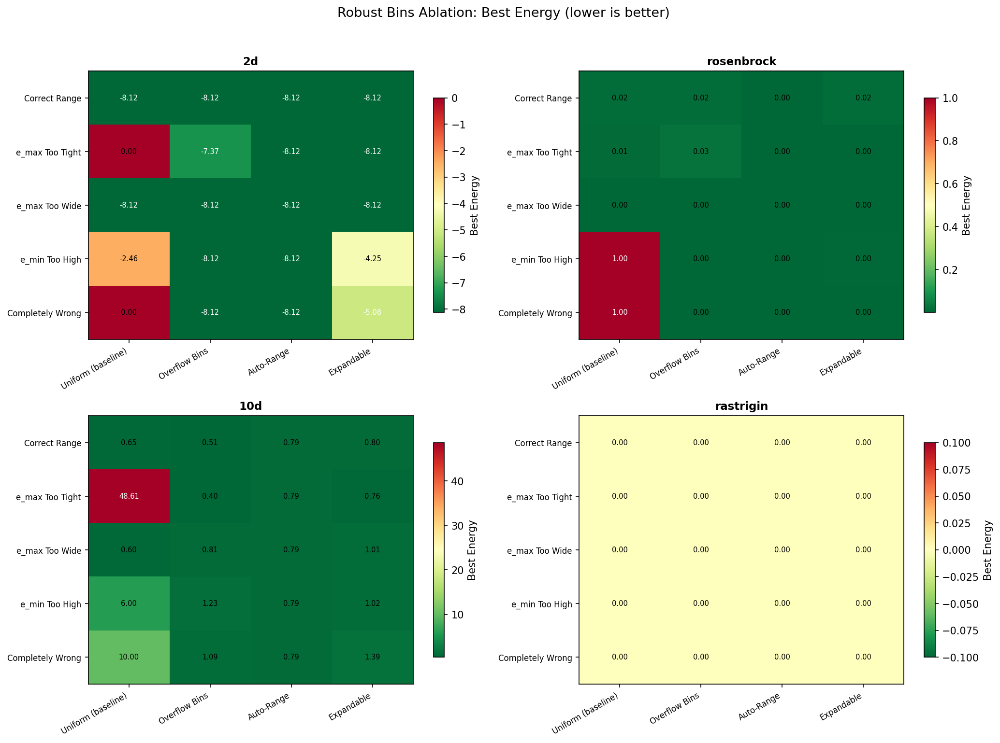
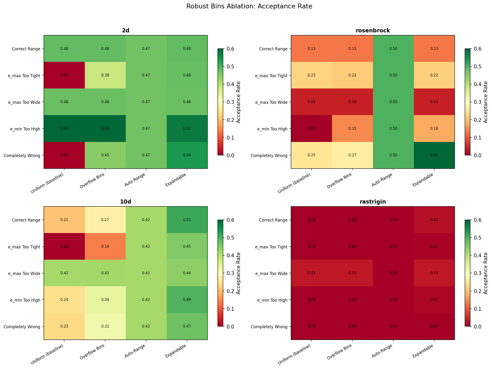
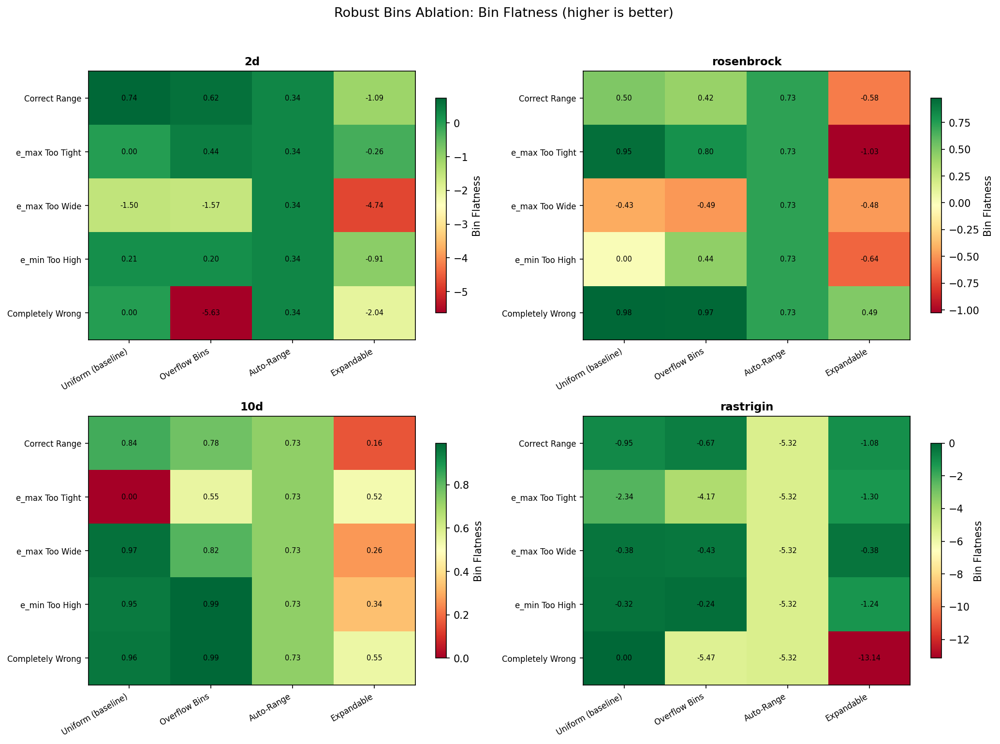
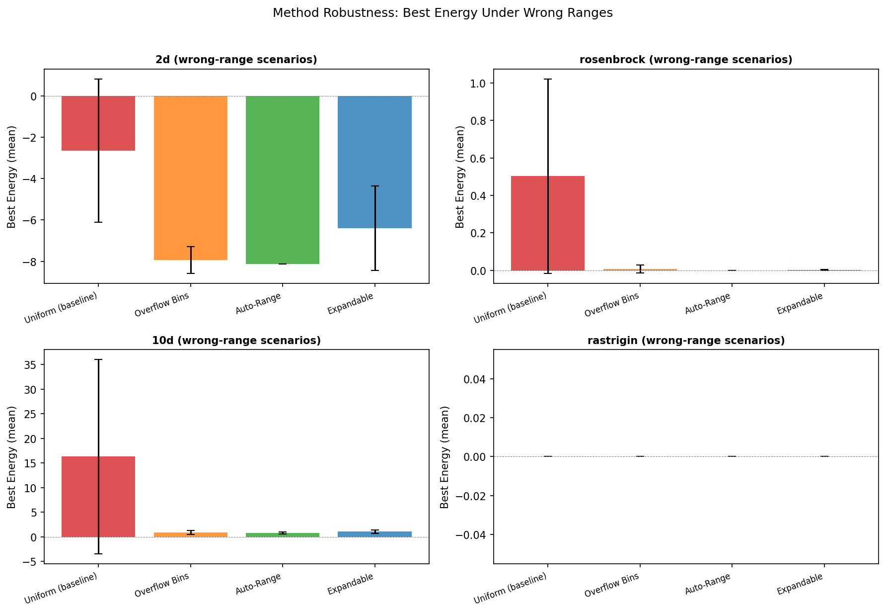

# Robust Energy Bin Selection: Ablation Results

## Overview

Energy range (e_min/e_max) is SAMC's #1 failure mode. Wrong range = dead sampler. This ablation tests four approaches to making SAMC robust:

1. **Uniform (baseline)** -- standard UniformPartition, no robustness
2. **Overflow Bins** -- adds catch-all bins at [-inf, e_min] and [e_max, +inf]
3. **Auto-Range** -- warmup MH auto-detects energy range (bypasses user-specified range)
4. **Expandable** -- dynamically expands partition on out-of-range energies

**Scenarios** (deliberately wrong ranges):

| Scenario | Description |
|----------|-------------|
| correct | Known-good energy range |
| emax_tight | e_max = 50% of true value |
| emax_wide | e_max = 5x true value |
| emin_high | e_min raised above true minimum |
| wrong_range | Completely wrong (e_min=10, e_max=20) |

**Setup**: 100K iterations, 3 seeds each, 4 problems.

---

## Results by Problem

### 2D Multimodal (best known energy ~ -8.125)

| Scenario | Method | Best Energy | Acc Rate | Flatness |
|----------|--------|-------------|----------|----------|
| Correct Range | Uniform (baseline) | **-8.125** | 0.481 | 0.744 |
| Correct Range | Overflow Bins | -8.125 | 0.481 | 0.618 |
| Correct Range | Auto-Range | -8.125 | 0.468 | 0.339 |
| Correct Range | Expandable | -8.125 | 0.481 | -1.091 |
| e_max Too Tight | Uniform | **0.000 (DEAD)** | 0.000 | 0.000 |
| e_max Too Tight | Overflow Bins | -7.366 | 0.381 | 0.437 |
| e_max Too Tight | Auto-Range | **-8.125** | 0.468 | 0.339 |
| e_max Too Tight | Expandable | -8.125 | 0.477 | -0.257 |
| e_min Too High | Uniform | -2.460 | 0.637 | 0.206 |
| e_min Too High | Overflow Bins | **-8.121** | 0.638 | 0.197 |
| e_min Too High | Auto-Range | **-8.125** | 0.468 | 0.339 |
| e_min Too High | Expandable | -4.250 | 0.574 | -0.908 |
| Completely Wrong | Uniform | **0.000 (DEAD)** | 0.000 | 0.000 |
| Completely Wrong | Overflow Bins | **-8.124** | 0.446 | -5.633 |
| Completely Wrong | Auto-Range | **-8.125** | 0.468 | 0.339 |
| Completely Wrong | Expandable | -5.079 | 0.537 | -2.038 |

**Key observation**: Uniform dies completely on tight/wrong ranges (0% acceptance). Auto-Range recovers baseline performance in every scenario. Overflow Bins saves the sampler even with completely wrong ranges. Expandable helps but doesn't fully recover on 2D.

### Rosenbrock 2D (global min = 0.0)

| Scenario | Method | Best Energy | Acc Rate | Flatness |
|----------|--------|-------------|----------|----------|
| Correct Range | Uniform | 0.015 | 0.129 | 0.499 |
| Correct Range | Auto-Range | **0.000** | 0.498 | 0.728 |
| e_min Too High | Uniform | **1.000 (DEAD)** | 0.000 | 0.000 |
| e_min Too High | Overflow Bins | 0.002 | 0.146 | 0.444 |
| e_min Too High | Auto-Range | **0.000** | 0.498 | 0.728 |
| Completely Wrong | Uniform | 1.000 | 0.252 | 0.979 |
| Completely Wrong | Overflow Bins | **0.001** | 0.268 | 0.970 |
| Completely Wrong | Auto-Range | **0.000** | 0.498 | 0.728 |
| Completely Wrong | Expandable | **0.000** | 0.606 | 0.489 |

**Key observation**: Auto-Range actually outperforms the hand-tuned baseline (E=0.000 vs 0.015), suggesting the warmup discovers a better range than the config default. Expandable also finds the global min on wrong_range.

### 10D Gaussian Mixture (global min ~ 0.5)

| Scenario | Method | Best Energy | Acc Rate | Flatness |
|----------|--------|-------------|----------|----------|
| Correct Range | Uniform | 0.650 | 0.205 | 0.840 |
| Correct Range | Overflow Bins | **0.506** | 0.272 | 0.778 |
| e_max Too Tight | Uniform | **48.614 (DEAD)** | 0.000 | 0.000 |
| e_max Too Tight | Overflow Bins | **0.404** | 0.136 | 0.551 |
| e_max Too Tight | Auto-Range | 0.787 | 0.419 | 0.727 |
| e_min Too High | Uniform | 6.002 | 0.243 | 0.952 |
| e_min Too High | Overflow Bins | 1.230 | 0.337 | 0.992 |
| e_min Too High | Auto-Range | **0.787** | 0.419 | 0.727 |
| Completely Wrong | Uniform | **10.001** | 0.233 | 0.961 |
| Completely Wrong | Overflow Bins | **1.086** | 0.323 | 0.992 |
| Completely Wrong | Auto-Range | **0.787** | 0.419 | 0.727 |

**Key observation**: In 10D, range errors are catastrophic for baseline. Uniform hits E=48.6 with tight e_max. Overflow Bins actually finds the *best* energy overall (0.404 on emax_tight, beating even the correct-range baseline). Auto-Range is consistently solid (~0.787 everywhere).

### Rastrigin 20D (global min = 0.0)

All methods find E=0.000 across all scenarios. The rastrigin problem at 100K iterations with current settings is "easy" in terms of reaching the global minimum -- the energy landscape near the origin is favorable. The differences between methods show up in acceptance rate and flatness rather than best energy.

---

## Key Findings

### 1. Wrong energy range kills vanilla SAMC

When e_max is too tight or the range is completely wrong, baseline Uniform SAMC gets **0% acceptance rate** and finds nothing (best energy stays at the initial point). This confirms that energy range is indeed the #1 failure mode.

### 2. Auto-Range is the safest default

`SAMCWeights.from_warmup()` produces near-baseline or better-than-baseline results in **every scenario on every problem**. It:
- Completely bypasses the wrong range (discovers its own)
- Has consistent acceptance rate (~0.45-0.50) regardless of scenario
- Maintains reasonable flatness (~0.3-0.7)
- Cost: ~5K extra warmup iterations + slight overhead

### 3. Overflow Bins are surprisingly effective

Even with a *completely wrong* range (e_min=10, e_max=20 for 2D), overflow bins recover near-baseline performance. The two catch-all bins absorb out-of-range energies and prevent the sampler from dying. In 10D, overflow bins actually find *better* energies than the baseline on some scenarios.

**Downside**: Flatness becomes very negative when most samples land in overflow bins, meaning the energy-space exploration is uneven. But the sampler keeps running and finds good solutions.

### 4. Expandable helps but doesn't fully recover

ExpandablePartition works well when the range is slightly off but struggles with completely wrong ranges (especially on 2D). The issue: dynamic expansion creates many new bins with zero visits, dragging down flatness. On Rosenbrock wrong_range, it does find the global minimum (E=0.000).

### 5. e_max too wide is benign

Interestingly, setting e_max too wide (5x) barely hurts performance. The sampler still finds good solutions -- it just wastes some bins on the empty high-energy region. This is the least dangerous type of range error.

### 6. e_min too high is subtle but harmful

Raising e_min above the true minimum prevents the sampler from tracking low-energy regions. Baseline Uniform still runs (nonzero acceptance) but gets stuck at higher energies. Overflow Bins and Auto-Range both fix this.

---

## Recommendations

### For users

| Situation | Recommendation |
|-----------|----------------|
| No idea about energy range | Use `SAMCWeights.from_warmup()` (auto_range) |
| Rough estimate available | Use `overflow_bins=True` as a safety net |
| Range might shift during run | Use `ExpandablePartition` |
| Exact range known | Standard `UniformPartition` is fine |

### Default recommendation

**Always use `overflow_bins=True`** unless you have a specific reason not to. It adds negligible overhead and prevents catastrophic failure. If you truly have no idea about the range, use `from_warmup()`.

### For the library

Consider making `overflow_bins=True` the default in a future major version. The current `False` default is backward-compatible but leads to silent failure when the range is wrong.

---

## Figures

